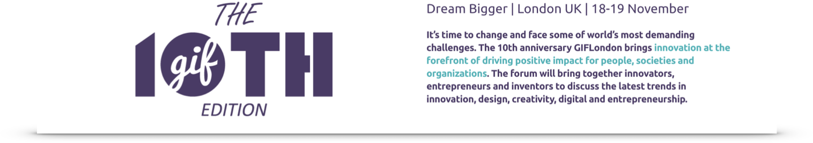

# For your toolbox

This is the [FAST](https://futuring-architectures.com/) manual to uncovering ecosystem innovation opportunities. It will be your companion in seeing people and organisations act in mutual context as they respond to emerging trends and forces.   

The manual is work in progress. When published, all contents will be available free of charge under a [Creative Commons Attribution-Share Alike 4.0 International License](https://creativecommons.org/licenses/by-sa/4.0/). Use, share, adapt as you see fit 👊

FAST Reveal will feature as a workshop at the [Global Innovation Forum](https://giflondon.com/). This conference is well worth your attendance—the workshop will be an added bonus.

